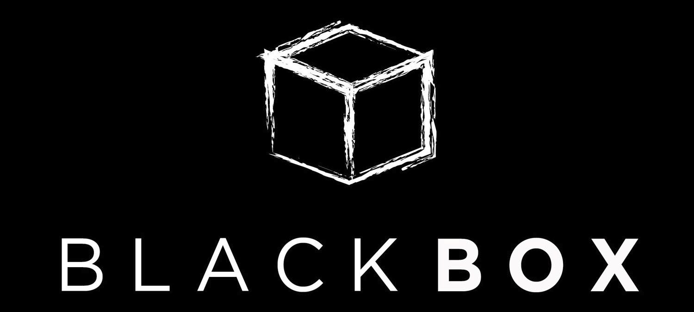

<h1 align="center"> MQTT Blackbox Exporter </h1>

    

    
    
    
    
    

## Introduction

In each probe it sends a message over MQTT broker and then wait for getting it over subscription.
By measuring this time and also connection, subscription etc. durations you can check your cluster status.
At Snapp! we use it to detect our EMQX clusters status from the client perspective.
